# Developer Specification (DEV_SPEC) — Knowledge Service

> 版本：1.0
> 
> 本规范定义了一个 RAG（Retrieval-Augmented Generation）知识服务平台的完整架构设计与开发排期。系统采用前后端分离架构，后端基于 FastAPI 提供 REST API 与 MCP SSE Transport，前端基于 React + TypeScript 构建可视化管理平台。

---

## 目录

- 项目概述
- 核心特点
- 技术选型
- 测试方案
- 系统架构与模块设计
- 项目排期

---

## 1. 项目概述

本项目构建一个可扩展、高可观测、易迭代的 RAG 知识检索服务平台。系统整体采用前后端分离架构：

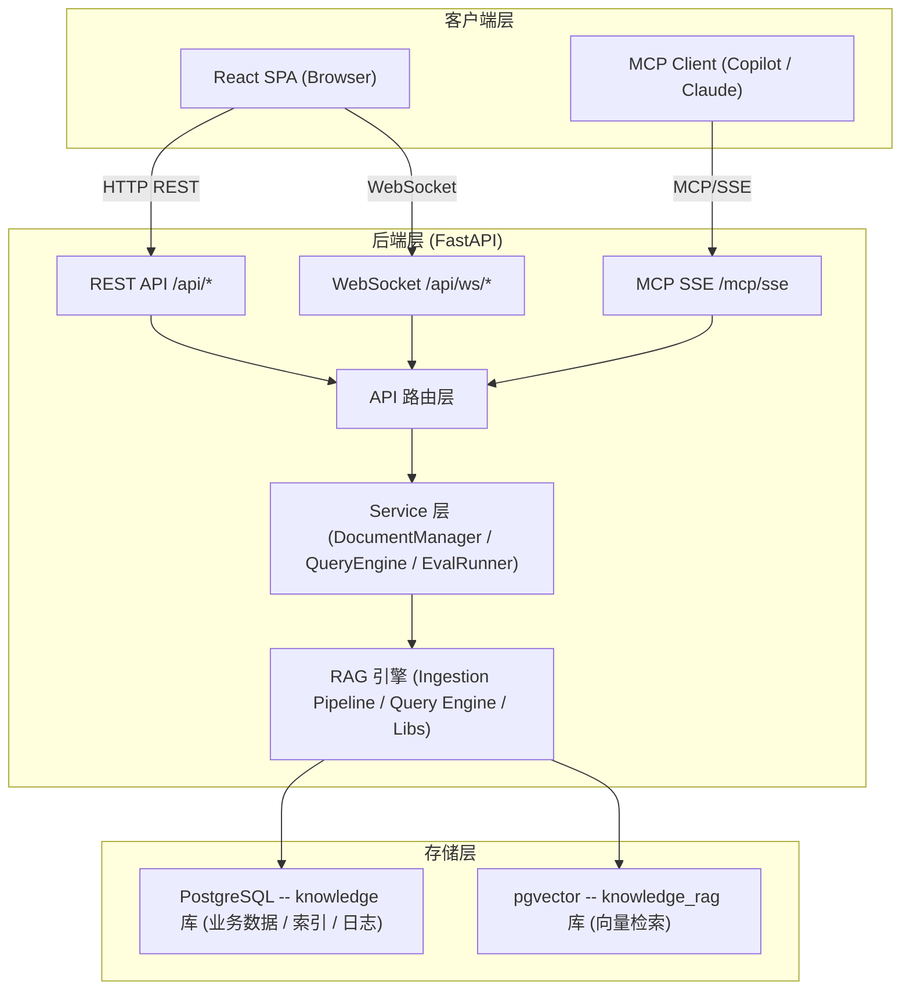

### 核心目标

| 维度 | 目标 |
|------|------|
| **后端** | FastAPI 统一 HTTP 入口，同时提供 REST API（供前端）和 MCP SSE Transport（供 Copilot/Claude） |
| **前端** | React + TypeScript + Ant Design 5 构建 8 页可视化管理平台 |
| **RAG 引擎** | 全链路可插拔架构，支持 Ingestion 摄取与 Query 检索双链路 |
| **存储** | PostgreSQL 存储业务数据，pgvector 扩展存储向量，支持多种文档类型（员工手册、合规指南、技术规范、架构文档）与中英文双语 |
| **可观测性** | structlog 结构化日志 + TraceContext 驱动，全链路白盒追踪 |
| **性能** | P90 端到端延迟 < 10s，单实例 ≥ 5 并发请求 |
| **部署** | 本地开发优先，单进程启动 |

---

## 2. 核心特点

### 2.1 前后端分离架构

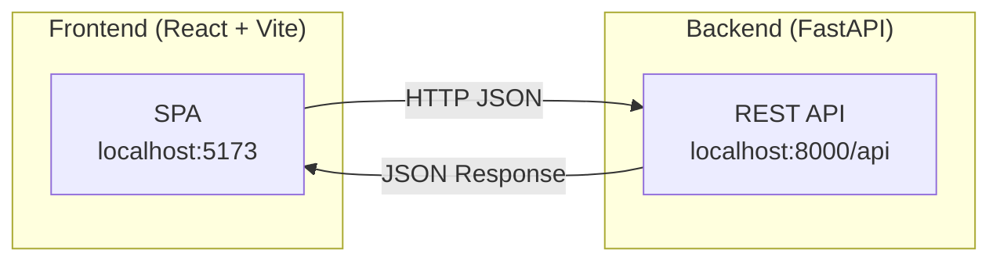

前后端通过 HTTP REST API 通信，职责清晰：

- **前端**：仅负责 UI 渲染和用户交互，所有数据通过 API 获取
- **后端**：统一服务入口，封装 RAG 引擎能力，通过 REST API 暴露

### 2.2 MCP SSE Transport

MCP Server 通过 FastAPI 的 SSE (Server-Sent Events) Transport 暴露，代替传统的 stdio 子进程模式：

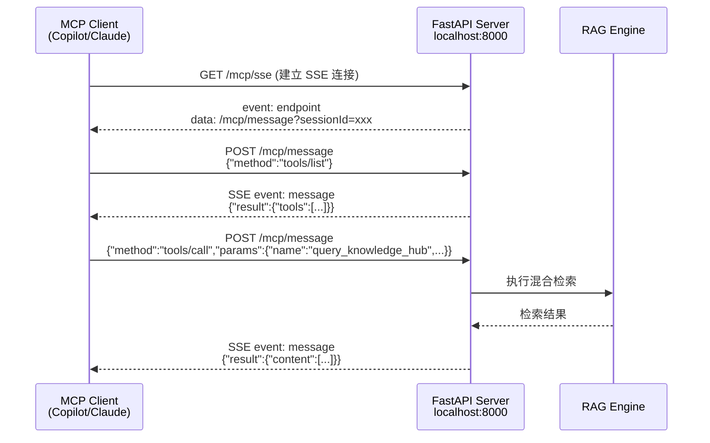

### 2.3 React 可视化管理平台

由 8 个功能页面组成的 SPA：

| 页面 | 路由 | 核心功能 |
|------|------|---------|
| 系统总览 (Overview) | `/overview` | 组件配置卡片、数据资产统计、健康状态 |
| 文档中心 (Document Center) | `/admin/documents` | 文档库管理、文件上传、批量操作、集合管理、状态监控 |
| AI 知识助手 | `/assistant` | 对话式智能问答（支持向量/混合两种检索模式、可开关重排序）、引用溯源、对话历史管理 |
| 数据浏览器 (Data Browser) | `/documents` | 文档列表（按类型/语言筛选）、Chunk 详情 |
| Ingestion 管理 | `/ingestion` | 文件上传（自动识别类型）、摄取进度、文档删除 |
| Ingestion 追踪 | `/ingestion/traces` | 摄取历史、阶段瀑布图 |
| Query 追踪 | `/query` | 查询历史、Dense/Sparse 对比、Rerank 变化、p50/p95 延迟、令牌用量、缓存命中率、拒绝率、答案符合率 |
| 评估面板 | `/evaluation` | 评估运行、指标展示、历史趋势 |

### 2.4 RAG 策略与设计亮点

**分块策略**：按文件类型自动选择最优分块策略（MD → MarkdownHeaderTextSplitter、HTML → HTMLHeaderTextSplitter、默认 → RecursiveCharacterTextSplitter），为不同类型文档保留最合适的语义结构。

**混合检索**：结合 BM25 稀疏检索（专有名词精确匹配）与 pgvector Dense Embedding 语义检索（同义词模糊匹配），通过 RRF (Reciprocal Rank Fusion) 算法融合结果。

**两段式精排**：粗排（混合检索快速召回）→ 精排（Cross-Encoder 或 LLM Rerank 深度排序），在不牺牲整体响应速度的前提下大幅提升 Top-K 精准度。

**多模态处理**：❌ 暂不实现（见 TODO 清单）

### 2.5 全链路可插拔架构

系统每一个核心环节均定义了抽象接口，通过 Factory + 配置驱动实现零代码替换：

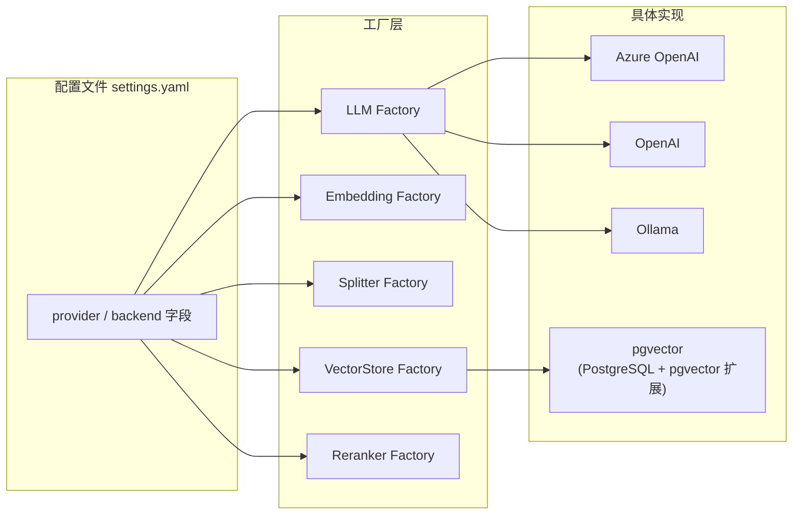

**可插拔组件一览**：

| 组件 | 抽象接口 | 默认实现 | 可替换选项 |
|------|---------|---------|----------|
| LLM | `BaseLLM` | Azure OpenAI | OpenAI / Ollama / DeepSeek |
| Embedding | `BaseEmbedding` | OpenAI text-embedding-3 | BGE / Ollama |
| Splitter | `BaseSplitter` | 按文件类型路由 | 见 3.1.1 节 |
| VectorStore | `BaseVectorStore` | pgvector | Qdrant / Pinecone |
| Reranker | `BaseReranker` | CrossEncoder | LLM Rerank / None |
| Evaluator | `BaseEvaluator` | Ragas | DeepEval / Custom |
| Loader | `BaseLoader` | PDF (MarkItDown) | Markdown / HTML |

### 2.6 多类型文档支持

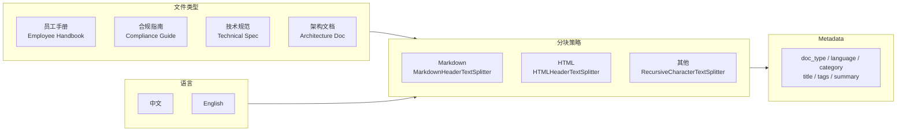

**文档分类与 Metadata**：

| 字段 | 说明 | 可选值 |
|------|------|--------|
| `doc_type` | 文件格式 | `pdf` / `md` / `html` |
| `category` | 知识分类 | `employee_handbook` / `compliance` / `technical_spec` / `architecture` |
| `language` | 语言 | `zh` / `en` |
| `source_path` | 原始路径 | 文件路径 |
| `title` | 标题 | 提取或自动生成 |
| `tags` | 标签 | MetadataEnricher 生成 |

### 2.7 多模态图片处理
 
> ❌ 当前因不具备 Vision LLM API 暂不实现此功能，详见 TODO 清单
 

### 2.8 结构化日志体系

采用 structlog 替代标准 logging，统一 JSON 格式输出，覆盖全链路追踪：

```mermaid
flowchart LR
    subgraph Sources["日志来源"]
        HTTP["HTTP 请求/响应<br/>event_type: http_request / http_response"]
        LLM_CALL["LLM 调用<br/>event_type: llm_call"]
        RETRIEVAL["检索过程<br/>event_type: retrieval"]
        ERROR["异常<br/>event_type: error"]
    end
    subgraph Fields["固定字段"]
        TS["timestamp / level / service"]
        TRACE["trace_id / span_id / parent_span_id"]
        REQ["request_id / event_type / message"]
        META["metadata / error / stack_trace"]
    end
    subgraph Output["输出"]
        JSON["JSON Lines<br/>logs/service.jsonl"]
        LOGROTATE["logrotate<br/>按大小/时间轮转"]
    end
    Sources --> Fields
    Fields --> Output
```

---

## 3. 技术选型

### 3.1 RAG 核心流水线设计

#### 3.1.1 数据摄取流水线 (Ingestion Pipeline)

采用自研 Pipeline 框架，实现可组合、可观测、可插拔的摄取流程：

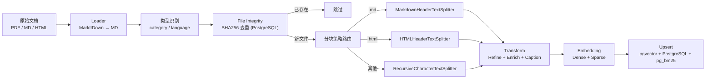

**Loader 阶段**：
- 输入：PDF / Markdown / HTML 文件
- 输出：`Document(text: Markdown, metadata)`
- 前置去重：SHA256 哈希 → 查询 `ingestion_history` 表（PostgreSQL）→ 相同则跳过
- 技术选型：MarkItDown（PDF → Markdown）
- Metadata 至少包含：`source_path`, `doc_type`, `category`, `language`, `title`, `page`, `images`

**Splitter 阶段**（按文件类型路由）：

| 文件类型 | 分块策略 | 说明 |
|---------|---------|------|
| `.md` | LangChain `MarkdownHeaderTextSplitter` | 按 Markdown 标题层级切分，保留标题结构 |
| `.html` | LangChain `HTMLHeaderTextSplitter` | 按 HTML 标题标签（h1/h2/h3）切分，保留 DOM 结构 |
| 其他（PDF 等） | LangChain `RecursiveCharacterTextSplitter` | 按层级分隔符递归切分 |

- 每个 Chunk 携带：`source`, `chunk_index`, `start_offset`, `end_offset`, `section_title`

**Transform 阶段**（原子化、幂等、可独立重试）：
- Chunk Refiner：智能重组去噪，合并语义紧密片段
- Metadata Enricher：利用 LLM 生成 Title / Summary / Tags

**Embedding 阶段**：
- Dense：调用 Embedding 模型生成高维浮点向量
- Sparse：BM25 编码生成关键词权重向量
- 差量计算：内容哈希检查，仅新增内容生成向量
- 批处理优化：`batch_size` 驱动

**Upsert 阶段**：
- **pgvector**：存储 Dense Vector + Chunk Content + Metadata，使用 PostgreSQL 的 `vector` 数据类型
- **pg_bm25 Index**：基于 pg_bm25 扩展的关键词倒排索引，存储在 PostgreSQL 中
- **Image Storage**：图片文件存储在本地文件系统
- 幂等设计：`chunk_id = hash(source_path + section_path + content_hash)`

**文档生命周期管理** (`DocumentManager`)：
- `list_documents()` — 按 category / language 筛选列出文档
- `get_document_detail()` — 获取文档详情及所有 Chunk
- `delete_document()` — 跨存储协调删除（pgvector + pg_bm25 + Image + PostgreSQL）
- `get_collection_stats()` — 按 category 统计

#### 3.1.2 检索流水线 (Query Pipeline)

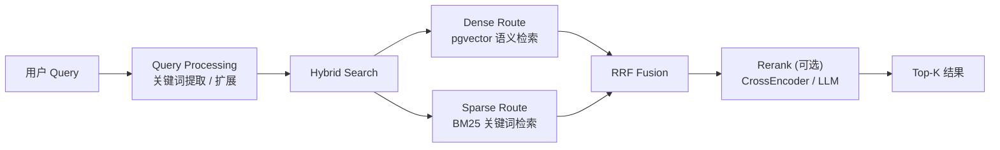

**Query Processing**：
- 输入：用户原始 Query
- 输出：`ProcessedQuery(original_query, keywords[], expansion[], filters)`
- 关键词提取 + 同义词/别名扩展 + Metadata 过滤解析（category / language / doc_type）

**Hybrid Search**：
- Dense Route：Query Embedding → pgvector `<=>` 余弦相似度检索 → Top-N 语义候选
- Sparse Route：BM25 倒排索引查询 → Top-N 关键词候选
- 支持 `category` / `language` 预过滤

**Fusion**：RRF (Reciprocal Rank Fusion)，`Score = 1/(k + Rank_Dense) + 1/(k + Rank_Sparse)`

**Rerank**（可选，可关闭）：
- None：直接返回 RRF 排序结果
- Cross-Encoder：本地模型，候选集 M=10~30
- LLM Rerank：云端模型，候选集 M≤20
- 失败时回退到 RRF 排序

### 3.2 后端服务设计 (FastAPI + MCP SSE)

#### 3.2.1 应用架构

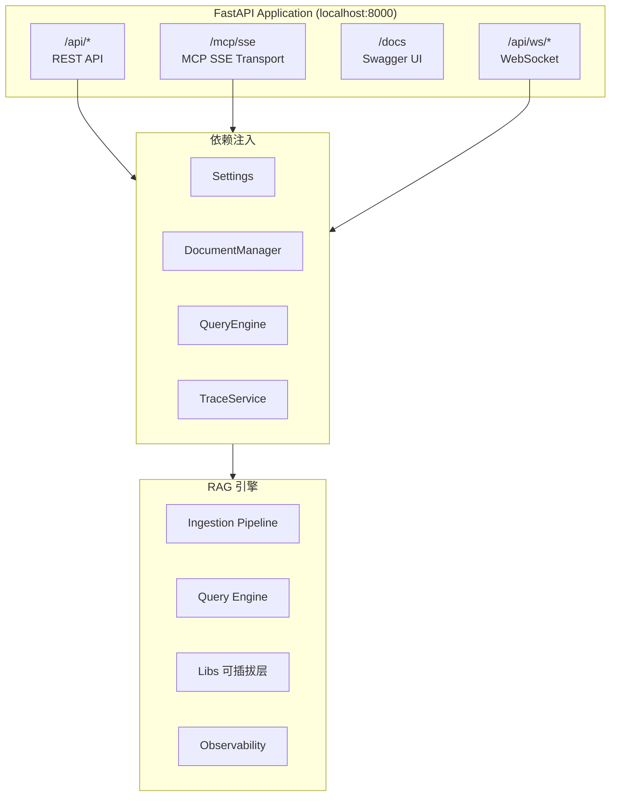

#### 3.2.2 REST API 端点设计

| 分组 | 方法 | 路径 | 描述 |
|------|------|------|------|
| 健康检查 | `GET` | `/api/health` | 服务健康状态 |
| 系统配置 | `GET` | `/api/config` | 获取当前组件配置 |
| 系统统计 | `GET` | `/api/stats` | 数据资产统计（按 category / language） |
| 集合列表 | `GET` | `/api/collections` | 列举所有集合 |
| 文档列表 | `GET` | `/api/documents` | 分页+筛选（category / language / doc_type） |
| 文档详情 | `GET` | `/api/documents/{doc_id}` | 文档信息 |
| 更新文档 | `PUT` | `/api/documents/{doc_id}` | 更新文档 metadata（title / category / language） |
| 文档统计 | `GET` | `/api/documents/stats` | 文档综合统计（按分类/语言/状态） |
| 批量删除 | `POST` | `/api/documents/batch-delete` | 批量删除文档 |
| 重新索引 | `POST` | `/api/documents/{doc_id}/reindex` | 重新摄取指定文档 |
| 文档 Chunks | `GET` | `/api/documents/{doc_id}/chunks` | 文档的所有 Chunk |
| Chunk 详情 | `GET` | `/api/chunks/{chunk_id}` | 单个 Chunk |
| 创建集合 | `POST` | `/api/collections` | 创建新集合 |
| 删除集合 | `DELETE` | `/api/collections/{name}` | 删除空集合 |
| 上传文件 | `POST` | `/api/ingestion/upload` | 文件上传到暂存 |
| 触发摄取 | `POST` | `/api/ingestion/run` | 执行摄取 Pipeline |
| 摄取进度 | `GET` | `/api/ingestion/status/{run_id}` | 摄取进度查询 |
| 摄取历史 | `GET` | `/api/ingestion/history` | 历史摄取记录 |
| 删除文档 | `DELETE` | `/api/documents/{doc_id}` | 跨存储删除 |
| 执行查询 | `POST` | `/api/query` | 混合检索查询 |
| 查询历史 | `GET` | `/api/query/traces` | 查询记录列表 |
| 查询追踪 | `GET` | `/api/query/traces/{trace_id}` | 单次查询详情 |
| 查询指标 | `GET` | `/api/query/metrics?period=24h` | 聚合指标：p50/p95 延迟、令牌用量、缓存命中率、拒绝率、答案符合率 |
| Ingestion 追踪 | `GET` | `/api/ingestion/traces` | 摄取历史列表 |
| Ingestion 详情 | `GET` | `/api/ingestion/traces/{trace_id}` | 单次摄取详情 |
| 触发评估 | `POST` | `/api/evaluation/run` | 执行评估任务 |
| 评估结果 | `GET` | `/api/evaluation/results` | 评估结果列表 |
| 评估详情 | `GET` | `/api/evaluation/results/{id}` | 单个评估结果 |
| 评估趋势 | `GET` | `/api/evaluation/history` | 历史趋势数据 |
| 图片服务 | `GET` | `/api/images/{collection}/{image_id}` | 图片文件 |

**文件上传约束**（适用于 `POST /api/ingestion/upload`）：
- **类型白名单**：仅允许 `pdf` / `md` / `html` 三种格式
- **大小上限**：默认 50MB（可通过 `settings.yaml` 的 `max_file_size` 配置）
- **速率限制**：每分钟最多上传 10 次（FastAPI 中间件层实现）
- **文件去重**：同名文件覆盖前检查 SHA256，内容未变则跳过
| AI 问答 | `POST` | `/api/assistant/query` | 智能问答（检索模式: vector_only/hybrid + 可选重排序 + LLM 总结回答） |
| 对话列表 | `GET` | `/api/assistant/history` | 对话历史列表 |
| 对话详情 | `GET` | `/api/assistant/history/{conv_id}` | 单次对话详情（含全部消息） |
| 删除对话 | `DELETE` | `/api/assistant/history/{conv_id}` | 删除对话 |

**`POST /api/assistant/query` 请求体：**

```json
{
  "query": "公司2025年营收情况",
  "search_mode": "hybrid",
  "rerank": true
}
```

**检索模式说明**：
| 模式 | 说明 | 适用场景 |
|------|------|---------|
| `hybrid` | Dense 语义向量 + Sparse BM25 关键词，RRF 融合排序 | 通用场景，兼顾语义与关键词匹配 |
| `vector_only` | 仅 Dense 语义向量检索，跳过 BM25 | 纯语义查询、关键词不明确的模糊问题 |

**重排序器控制**：
- 全局开关：`settings.yaml` 中 `retrieval.rerank_backend: none` 禁用，`cross_encoder` / `llm` 启用
- 当全局禁用时，`rerank` 参数无效（固定为 false）
- 当全局启用时，`rerank` 参数默认为 true，可单次关闭

#### 3.2.3 WebSocket 实时推送

提供 Ingestion Pipeline 进度实时推送，前端通过 WebSocket 连接订阅运行状态。适用于大文件摄取时的异步进度展示场景。

**端点**：

| 端点 | 方向 | 描述 |
|------|------|------|
| `WS /api/ws/ingestion/{run_id}` | 服务端→客户端 | Pipeline 执行进度实时推送 |

**事件格式**：

```json
{
  "event": "progress",
  "data": {
    "run_id": "uuid",
    "stage": "loading / splitting / embedding / indexing",
    "progress": 0.45,
    "message": "正在处理 Chunk 45/100"
  }
}
```

**事件类型**：

| 事件 | 说明 |
|------|------|
| `progress` | Pipeline 阶段进度更新 |
| `complete` | 整个 Pipeline 执行完成 |
| `error` | 执行过程中发生错误 |

**实现方式**：FastAPI 原生 WebSocket 端点，Pipeline 执行中通过 `on_progress` 回调广播状态。

#### 3.2.4 MCP SSE Transport

**端点**：
- `GET /mcp/sse` — 建立 SSE 连接，服务端推送 `event: endpoint` → 客户端获取 `sessionId`
- `POST /mcp/message` — 客户端发送 JSON-RPC 2.0 请求（携带 `sessionId` 参数）

**注册的 MCP 工具**：

| 工具名称 | 功能 | 输入 | 输出 |
|---------|------|------|------|
| `query_knowledge_hub` | 混合检索 | `query`, `top_k?`, `collection?`, `rerank?`, `category?`, `language?` | 带引用结果 |
| `list_collections` | 列举集合 | 无 | 集合名、文档数 |
| `get_document_summary` | 文档摘要 | `doc_id` | 标题、摘要、元信息 |

**实现方式**：使用 MCP SDK 的 SSE transport 支持，在同一 FastAPI 进程中集成，与 REST API 共享同一套 RAG 引擎。

#### 3.2.5 数据库配置

**PostgreSQL（业务数据）**：

| 项目 | 值 |
|------|-----|
| 主机 | `localhost:5432` |
| 用户名 | `postgres` |
| 密码 | `root123456` |
| 数据库 | `knowledge` |
| 用途 | 业务数据、文件完整性索引、图片索引、评估结果、追踪日志 |

**pgvector（向量数据）**：

| 项目 | 值 |
|------|-----|
| 主机 | `localhost:5432` |
| 用户名 | `postgres` |
| 密码 | `root123456` |
| 数据库 | `knowledge_rag` |
| 用途 | Dense Vector 语义检索 |
| 扩展 | `pgvector`（提供 `vector` 数据类型与 `<=>` 距离算子） |

**pg_bm25（全文检索数据）**：

| 项目 | 值 |
|------|-----|
| 主机 | `localhost:5432` |
| 用户名 | `postgres` |
| 密码 | `root123456` |
| 数据库 | `knowledge_rag` |
| 用途 | 全文检索 + BM25 倒排索引 |
| 扩展 | `pg_bm25` + `pg_search`（提供 BM25 索引与全文检索能力，基于 `pg_bm25` 扩展支持 BM25 算法，基于 `pg_search` 扩展支持全文检索与混合搜索） |


#### 3.2.6 表结构设计

分为两个数据库：`knowledge`（业务数据）和 `knowledge_rag`（向量 + 全文检索）。

**knowledge 库（业务数据）：**

```sql
-- 文档元数据
CREATE TABLE documents (
    id              UUID PRIMARY KEY DEFAULT gen_random_uuid(),
    title           TEXT NOT NULL,
    doc_type        TEXT NOT NULL DEFAULT 'pdf',                        -- pdf / md / html
    category        TEXT NOT NULL DEFAULT 'employee_handbook',          -- employee_handbook / compliance / technical_spec / architecture
    language        TEXT NOT NULL DEFAULT 'zh',                         -- zh / en
    source_path     TEXT NOT NULL,
    file_hash       TEXT NOT NULL,                                      -- SHA256
    file_size       BIGINT NOT NULL,
    status          TEXT NOT NULL DEFAULT 'pending',                    -- pending / processing / completed / failed
    tags            JSONB DEFAULT '[]',
    summary         TEXT,
    metadata        JSONB DEFAULT '{}',                                 -- 扩展字段
    created_at      TIMESTAMPTZ DEFAULT NOW(),
    updated_at      TIMESTAMPTZ DEFAULT NOW()
);
CREATE UNIQUE INDEX idx_documents_file_hash ON documents(file_hash);
CREATE INDEX idx_documents_category ON documents(category);
CREATE INDEX idx_documents_language ON documents(language);
CREATE INDEX idx_documents_status ON documents(status);
```

```sql
-- 文件摄取历史
CREATE TABLE ingestion_history (
    id              UUID PRIMARY KEY DEFAULT gen_random_uuid(),
    document_id     UUID REFERENCES documents(id) ON DELETE CASCADE,
    source_path     TEXT NOT NULL,
    file_hash       TEXT NOT NULL,
    status          TEXT NOT NULL DEFAULT 'pending',                    -- pending / running / completed / failed
    total_chunks    INTEGER DEFAULT 0,
    total_images    INTEGER DEFAULT 0,
    error_message   TEXT,
    started_at      TIMESTAMPTZ,
    completed_at    TIMESTAMPTZ,
    created_at      TIMESTAMPTZ DEFAULT NOW()
);
CREATE INDEX idx_ingestion_document_id ON ingestion_history(document_id);
CREATE INDEX idx_ingestion_status ON ingestion_history(status);
```

```sql
-- 图片索引（预留，当前暂不实现图片提取与索引）
CREATE TABLE image_index (
    id              UUID PRIMARY KEY DEFAULT gen_random_uuid(),
    document_id     UUID REFERENCES documents(id) ON DELETE CASCADE,
    chunk_id        TEXT,
    image_path      TEXT NOT NULL,
    image_hash      TEXT,
    alt_text        TEXT,
    width           INTEGER,
    height          INTEGER,
    created_at      TIMESTAMPTZ DEFAULT NOW()
);
CREATE INDEX idx_image_document_id ON image_index(document_id);
```

```sql
-- 评估结果
CREATE TABLE evaluation_results (
    id              UUID PRIMARY KEY DEFAULT gen_random_uuid(),
    run_id          TEXT NOT NULL,
    evaluator       TEXT NOT NULL,                                      -- ragas / custom
    category        TEXT,                                               -- 按分类评估
    metrics         JSONB NOT NULL,
    total_queries   INTEGER NOT NULL DEFAULT 0,
    passed_queries  INTEGER NOT NULL DEFAULT 0,
    avg_score       REAL DEFAULT 0,
    created_at      TIMESTAMPTZ DEFAULT NOW()
);
CREATE INDEX idx_eval_run_id ON evaluation_results(run_id);
CREATE INDEX idx_eval_category ON evaluation_results(category);
```

```sql
-- 业务追踪日志（Query / Ingestion）
CREATE TABLE traces (
    id                BIGSERIAL PRIMARY KEY,
    trace_id          UUID NOT NULL UNIQUE,
    trace_type        TEXT NOT NULL,                                    -- query / ingestion
    status            TEXT NOT NULL DEFAULT 'completed',
    stages            JSONB NOT NULL DEFAULT '{}',
    total_latency_ms  INTEGER DEFAULT 0,                                -- p50/p95 延迟由此字段计算
    input_tokens      INTEGER DEFAULT 0,                                -- 令牌使用情况
    output_tokens     INTEGER DEFAULT 0,
    total_tokens      INTEGER DEFAULT 0,
    cache_hit         BOOLEAN DEFAULT FALSE,                            -- 缓存命中率
    rejected          BOOLEAN DEFAULT FALSE,                            -- 拒绝率
    rejection_reason  TEXT,
    compliance_score  REAL,                                             -- 答案符合率
    metadata          JSONB DEFAULT '{}',
    started_at        TIMESTAMPTZ DEFAULT NOW(),
    completed_at      TIMESTAMPTZ
);
CREATE INDEX idx_traces_trace_id ON traces(trace_id);
CREATE INDEX idx_traces_type ON traces(trace_type);
CREATE INDEX idx_traces_started_at ON traces(started_at DESC);
```

```sql
-- 查询缓存
CREATE TABLE query_cache (
    cache_key       TEXT PRIMARY KEY,
    query_text      TEXT NOT NULL,
    search_mode     TEXT,
    rerank          BOOLEAN,
    results         JSONB NOT NULL,
    hit_count       INTEGER DEFAULT 1,
    created_at      TIMESTAMPTZ DEFAULT NOW(),
    expires_at      TIMESTAMPTZ DEFAULT NOW() + INTERVAL '1 hour'
);
CREATE INDEX idx_query_cache_expires ON query_cache(expires_at);
```

```sql
-- Embedding 缓存
CREATE TABLE embedding_cache (
    id              UUID PRIMARY KEY DEFAULT gen_random_uuid(),
    provider        TEXT NOT NULL,
    model           TEXT NOT NULL,
    content_hash    TEXT NOT NULL,
    embedding       vector(1536),
    created_at      TIMESTAMPTZ DEFAULT NOW(),
    UNIQUE(provider, model, content_hash)
);
```

```sql
-- 对话列表
CREATE TABLE conversations (
    id              UUID PRIMARY KEY DEFAULT gen_random_uuid(),
    title           TEXT NOT NULL DEFAULT '新对话',
    search_mode     TEXT DEFAULT 'hybrid',                              -- vector_only / hybrid
    rerank_enabled  BOOLEAN DEFAULT TRUE,
    message_count   INTEGER DEFAULT 0,
    created_at      TIMESTAMPTZ DEFAULT NOW(),
    updated_at      TIMESTAMPTZ DEFAULT NOW()
);
CREATE INDEX idx_conversations_updated ON conversations(updated_at DESC);
```

```sql
-- 对话消息
CREATE TABLE conversation_messages (
    id              BIGSERIAL PRIMARY KEY,
    conversation_id UUID REFERENCES conversations(id) ON DELETE CASCADE,
    role            TEXT NOT NULL,                                       -- user / assistant
    content         TEXT NOT NULL,
    citations       JSONB DEFAULT '[]',
    tokens          INTEGER DEFAULT 0,
    latency_ms      INTEGER DEFAULT 0,
    created_at      TIMESTAMPTZ DEFAULT NOW()
);
CREATE INDEX idx_messages_conv_id ON conversation_messages(conversation_id);
CREATE INDEX idx_messages_created ON conversation_messages(created_at);
```

**knowledge_rag 库（向量 + 全文检索）：**

```sql
-- pgvector 扩展
CREATE EXTENSION IF NOT EXISTS vector;

-- 文档 Chunk（含 Dense 向量 + Metadata）
CREATE TABLE document_chunks (
    id              UUID PRIMARY KEY DEFAULT gen_random_uuid(),
    document_id     UUID NOT NULL,
    chunk_index     INTEGER NOT NULL,
    content         TEXT NOT NULL,
    content_hash    TEXT NOT NULL,                                       -- 内容 SHA256，差量更新依据
    section_title   TEXT,
    doc_type        TEXT NOT NULL,
    category        TEXT NOT NULL,
    language        TEXT NOT NULL,
    embedding       vector(1536),                                        -- Dense 语义向量
    metadata        JSONB DEFAULT '{}',
    created_at      TIMESTAMPTZ DEFAULT NOW()
);
CREATE INDEX idx_chunks_document_id ON document_chunks(document_id);
CREATE INDEX idx_chunks_category ON document_chunks(category);
CREATE INDEX idx_chunks_language ON document_chunks(language);
CREATE INDEX idx_chunks_content_hash ON document_chunks(content_hash);
-- HNSW 索引（推荐，查询性能优于 IVFFlat，适合高并发只读场景）
CREATE INDEX idx_chunks_embedding_hnsw ON document_chunks
    USING hnsw (embedding vector_cosine_ops) WITH (m = 16, ef_construction = 200);
```

```sql
-- pg_bm25 + pg_search 扩展
CREATE EXTENSION IF NOT EXISTS pg_bm25;
CREATE EXTENSION IF NOT EXISTS pg_search;

-- BM25 全文搜索索引（基于 pg_bm25 扩展的倒排索引）
CREATE INDEX idx_chunks_bm25 ON document_chunks
    USING bm25 (content, section_title, category, language)
    WITH (key_field = 'id');
```

### 3.3 前端技术选型

| 技术 | 版本 | 用途 |
|------|------|------|
| React | 19+ | UI 框架 |
| TypeScript | 5+ | 类型安全 |
| Vite | 5+ | 构建工具 |
| React Router | v7 | SPA 路由 |
| Axios | 1+ | HTTP 客户端 |
| Ant Design | 5 | UI 组件库 |
| Recharts | 2+ | 图表组件 |
| @ant-design/icons | — | 图标 |

### 3.4 可插拔架构设计

#### 设计原则

- **接口隔离**：每类组件定义最小化抽象接口，上层仅依赖接口而非实现
- **配置驱动**：通过 `settings.yaml` 指定各组件的具体后端，零代码修改切换
- **工厂模式**：工厂函数根据配置动态实例化对应实现
- **优雅降级**：首选后端不可用时自动回退到备选方案

#### 通用结构

```
业务代码
  │
  ▼
<Component>Factory.get_xxx()  ← 读取配置
  │
  ├─→ ImplementationA()
  ├─→ ImplementationB()
  └─→ ImplementationC()
      │
      ▼
    都实现了统一的抽象接口
```

#### 各组件抽象

**LLM 与 Embedding**：

| 提供者 | 场景 | 配置 |
|--------|------|------|
| Azure OpenAI | 企业合规、私有云部署 | `provider: azure` |
| OpenAI 原生 | 通用开发、最新模型 | `provider: openai` |
| DeepSeek | 成本优化 | `provider: deepseek` |
| Ollama | 完全离线、隐私敏感 | `provider: ollama` |


**向量存储**：`BaseVectorStore` 接口，默认实现 pgvector。

### 3.5 可观测性与可视化管理平台

#### 3.5.1 Trace 数据结构

**Query Trace** (`trace_type="query"`)：

| 字段 | 说明 |
|------|------|
| `trace_id` | 请求唯一标识 |
| `user_query` | 用户原始查询 |
| `collection` | 检索集合 |
| `stages.query_processing` | 关键词提取、扩展、耗时 |
| `stages.dense_retrieval` | 语义候选 Top-N、provider、耗时 |
| `stages.sparse_retrieval` | BM25 候选 Top-N、method、耗时 |
| `stages.fusion` | RRF 融合算法、耗时 |
| `stages.rerank` | 精排 backend、候选数变化、fallback、耗时 |
| `total_latency_ms` | 端到端总耗时（p50/p95 由此字段聚合计算） |
| `input_tokens` | 输入令牌数（LLM + Embedding 调用） |
| `output_tokens` | 输出令牌数（LLM 响应） |
| `total_tokens` | 总令牌数 = input + output |
| `cache_hit` | 是否命中缓存（Embedding / 结果缓存） |
| `rejected` | 是否被拒绝（限流 / 内容过滤） |
| `rejection_reason` | 拒绝原因 |
| `compliance_score` | 答案符合率 0-1 |
| `top_k_results` | 最终 Chunk ID 列表 |

**Ingestion Trace** (`trace_type="ingestion"`)：

| 字段 | 说明 |
|------|------|
| `trace_id` | 摄取唯一标识 |
| `source_path` | 源文件路径 |
| `collection` | 目标集合 |
| `stages.load` | 文件大小、解析器、图片数、耗时 |
| `stages.split` | splitter 类型、chunk 数、平均长度、耗时 |
| `stages.transform` | refine/enrich/caption 数量、LLM provider、耗时 |
| `stages.embed` | embedding provider、批次数、维度、耗时 |
| `stages.upsert` | 存储后端、upsert 数、BM25 更新、图片存储、耗时 |
| `total_chunks` / `total_images` | 处理统计 |

#### 3.5.2 结构化日志框架

采用 **structlog** 替代标准 Python logging，统一 JSON 格式输出，包含完整追踪上下文。

**固定字段定义**：

| 字段 | 类型 | 必填 | 说明 |
|------|------|------|------|
| `timestamp` | string (ISO 8601) | 是 | 日志时间戳，精确到毫秒 |
| `level` | string | 是 | 日志级别：DEBUG / INFO / WARNING / ERROR / CRITICAL |
| `service` | string | 是 | 服务标识：`qa_service`（API 层）或 `engine`（RAG 引擎） |
| `trace_id` | string (UUID) | 是 | 分布式追踪 ID，跨服务传递 |
| `span_id` | string (UUID) | 是 | 当前服务 span ID |
| `parent_span_id` | string (UUID) | 否 | 上游服务 span ID |
| `request_id` | string (UUID) | 是 | 前端请求 ID，唯一标识一次用户交互 |
| `event_type` | string | 是 | 事件类型：`http_request` / `http_response` / `llm_call` / `retrieval` / `error` |
| `message` | string | 是 | 人类可读日志消息 |
| `metadata` | object | 否 | 业务上下文（会话 ID、用户标识、文档 ID、耗时等） |
| `error` | string | 否 | 错误信息（仅 ERROR 级别） |
| `stack_trace` | string | 否 | 异常堆栈（仅 ERROR 级别） |

**日志文件**：
- 路径：`logs/service.jsonl`
- 格式：每一行一个完整 JSON 对象
- 轮转：通过 logrotate 配置按大小轮转

**logrotate 配置**：
```conf
# /etc/logrotate.d/knowledge-service
/var/log/knowledge-service/*.jsonl {
    daily
    rotate 30
    size 100M
    compress
    delaycompress
    missingok
    notifempty
    copytruncate
}
```

#### 3.5.3 技术方案

- **记录**：structlog 的 `bind()` 注入 trace_id / span_id / request_id 上下文
- **持久化**：Pipeline / Query Engine 执行时通过 TraceContext 记录各阶段数据
- **读取**：REST API 读取 JSON Lines 文件返回给前端

```python
# structlog 配置示例
import structlog

structlog.configure(
    processors=[
        structlog.stdlib.filter_by_level,
        structlog.stdlib.add_logger_name,
        structlog.stdlib.add_log_level,
        structlog.processors.TimeStamper(fmt="iso"),
        structlog.processors.JSONRenderer(),
    ],
    context_class=dict,
    logger_factory=structlog.PrintLoggerFactory(),
    cache_logger_on_first_use=True,
)
```

#### 3.5.4 Dashboard 页面路由

| 路由 | 页面 | API 数据源 |
|------|------|-----------|
| `/overview` | 系统总览 | `GET /api/config`, `/api/stats` |
| `/admin/documents` | 文档中心 | `GET /api/documents/*`, `POST /api/ingestion/*`, `GET /api/collections` |
| `/admin/documents/:id` | 文档详情 | `GET /api/documents/{id}/chunks`, `PUT /api/documents/{id}` |
| `/assistant` | AI 知识助手 | `POST /api/assistant/query`, `GET /api/assistant/history` |
| `/assistant/:id` | 对话详情 | `GET /api/assistant/history/{id}` |
| `/documents` | 数据浏览 | `GET /api/documents/*`, `/api/collections` |
| `/documents/:id` | 文档详情 | `GET /api/documents/{id}/chunks` |
| `/ingestion` | Ingestion 管理 | `POST /api/ingestion/*`, `DELETE /api/documents/{id}` |
| `/ingestion/traces` | Ingestion 追踪 | `GET /api/ingestion/traces` |
| `/ingestion/traces/:id` | 追踪详情 | `GET /api/ingestion/traces/{trace_id}` |
| `/query` | Query 追踪 | `GET /api/query/traces` + `GET /api/query/metrics` |
| `/query/traces/:id` | 查询详情 | `GET /api/query/traces/{trace_id}` |
| `/evaluation` | 评估面板 | `POST /api/evaluation/run`, `GET /api/evaluation/*` |


### 3.7 性能设计

#### 3.7.1 性能目标

| 指标 | 目标 | 说明 |
|------|------|------|
| P90 延迟 | < 10s | **仅限检索/问答链路**（AI 知识助手 Query + LLM 回答），不含文件上传/摄取等后台操作 |
| 并发能力 | ≥ 5 | 单实例同时处理 ≥ 5 个检索请求，无排队阻塞 |
| 缓存命中 | > 30% | Embedding 缓存 + 查询结果缓存覆盖 30% 以上重复请求 |

> Ingestion Pipeline（文件上传、PDF 解析、分块、向量化）为后台异步任务，不纳入此性能指标。
> 前端上传后显示"处理中"状态，Pipeline 完成后更新数据库状态，前端刷新即可看到最新结果。

#### 3.7.2 关键路径延迟预算

```
Query 链路（含 LLM 回答）延迟拆解（目标 < 10s）：
  Query Processing    ~50ms      关键词提取 / 扩展
  Dense Retrieval     ~200ms     pgvector <=> 查询（HNSW 索引，top-50）
  Sparse Retrieval    ~200ms     pg_bm25 BM25 查询
  RRF Fusion          ~10ms      内存排序
  Rerank              ~2s        Cross-Encoder 对 20 候选评分（可选）
  LLM Answer          ~5s        gpt-4o-mini 总结回答
  网络/序列化         ~500ms
  ─────────────────────────────
  合计                ~8s        OK < 10s
```

#### 3.7.3 缓存策略

**Query Result Cache**：

```sql
CREATE TABLE query_cache (
    cache_key   TEXT PRIMARY KEY,                          -- hash(query + search_mode + rerank)
    query_text  TEXT NOT NULL,
    search_mode TEXT,
    rerank      BOOLEAN,
    results     JSONB NOT NULL,                            -- 缓存的 Top-K chunks
    hit_count   INTEGER DEFAULT 1,
    created_at  TIMESTAMPTZ DEFAULT NOW(),
    expires_at  TIMESTAMPTZ DEFAULT NOW() + INTERVAL '1 hour'
);
```

- 写入：Query 完成后写入缓存，TTL 默认 1h（`settings.yaml` 可配 `query_cache_ttl_seconds`）
- 读取：Query 入口处检查缓存，命中直接返回
- 淘汰：定期清理过期条目（BackgroundTask 每小时执行）

**Embedding Cache**（复用 Ingestion 阶段的差量计算逻辑）：
- Query Embedding 按内容哈希查缓存，已存在则跳过 API 调用
- 缓存表集成在 `knowledge_rag` 库中，按 provider + model + content_hash 索引

#### 3.7.4 并发策略

| 维度 | 方案 | 说明 |
|------|------|------|
| **Web 服务** | FastAPI 异步 + uvicorn worker | 单进程 async 即可承载 ≥ 5 并发，无需多 worker |
| **数据库连接池** | `max_connections = 20` | PostgreSQL 连接池（`psycopg2` async 或 `asyncpg`） |
| **pgvector 索引** | HNSW（`hnsw`）替代 IVFFlat | HNSW 查询更快（~5ms vs ~50ms），适合高并发只读场景 |
| **LLM 调用** | `asyncio.to_thread()` + 超时控制 | LLM SDK 为同步调用时抛到线程池执行，设 timeout=15s |
| **Ingestion Pipeline** | 后台异步任务 | 文件上传 / PDF 解析 / 分块 / Embedding 均为后台执行，不占用实时检索的线程资源，前端通过轮询或 WebSocket 获取进度 |

#### 3.7.5 pgvector 索引建议

```sql
-- HNSW 索引（推荐，查询性能优于 IVFFlat）
CREATE INDEX idx_chunks_embedding_hnsw ON document_chunks
    USING hnsw (embedding vector_cosine_ops)
    WITH (m = 16, ef_construction = 200);

-- 注：HNSW 构建比 IVFFlat 慢，内存占用更高，但查询更快
-- 适合：并发高、读多写少的场景
-- 数据变化后需要 REINDEX
```

### 3.8 数据持久化层（技术选型）

当前项目使用 **asyncpg** 直接执行原始 SQL 进行所有数据库操作。这种方式的优点是无依赖、性能直接，但长期维护存在以下问题：

| 问题 | 说明 |
|------|------|
| **类型安全** | 原始 SQL 的行结果需手动映射为 Python 对象，易出错 |
| **迁移管理** | 无版本化迁移工具，`init_knowledge_db.sql` 需手动执行，增量变更靠人工 DDL |
| **可测试性** | 单元测试需连接真实数据库，Mock 层缺失 |
| **代码组织** | SQL 散落在 API 层、Pipeline 层，职责不清，难以单独维护 |

#### 迁移路线图（两阶段）

**第一阶段：Repository 模式（零额外依赖，优先执行）**

在不动底层 asyncpg 的前提下，将散落在各处的 SQL 抽取到 **Repository 类** 中：

```python
class DocumentRepository:
    def __init__(self, pool: asyncpg.Pool):
        self._pool = pool
    
    async def find_by_id(self, doc_id: str) -> DocumentRecord | None: ...
    async def find_by_hash(self, file_hash: str) -> DocumentRecord | None: ...
    async def save(self, doc: DocumentRecord) -> None: ...
    async def delete(self, doc_id: str) -> None: ...
```

优点：几乎零风险，SQL 逻辑集中化，接口契约化，后续迁移 SQLAlchemy 时只改 Repository 内部实现。

**第二阶段：SQLAlchemy 2.0 async + Alembic**

引入 SQLAlchemy 2.0 async 和 Alembic，完成全链路重写：

| 组件 | 说明 |
|------|------|
| `sqlalchemy[asyncio]` | ORM 引擎 + Model 定义 |
| `asyncpg` | 仍作为 async DB Driver（SQLAlchemy 底层复用 asyncpg） |
| `alembic` | 数据库迁移管理，替代手动 SQL 脚本 |
| `pydantic` v2 | 定义 Schema / DTO，分离 ORM 层与 API 层模型 |

SQLAlchemy + Pydantic 的组合效果类似 Spring 的 MyBatis + DTO：

```
asyncpg SQL（原始） → Repository 类（SQL 集中化） → SQLAlchemy ORM（模型驱动） → Pydantic Schema（API 序列化）
```

---

---

## 4. 测试方案

### 4.1 设计理念：测试驱动开发 (TDD)

- **先写测试，再写实现**：每个阶段的每个子任务，优先编写测试用例，再编写功能代码
- **测试即文档**：测试用例应清晰表达模块的预期行为和边界条件
- **可重复执行**：所有测试支持重复执行，不依赖外部环境状态

### 4.2 测试分层策略

| 层级 | 覆盖范围 | 技术 | 运行频率 |
|------|---------|------|---------|
| **Unit** | 独立模块逻辑 | pytest (backend) / vitest (frontend) | 每次提交 |
| **Integration** | 模块间交互 | pytest + mock 外部服务 | 每次提交 |
| **E2E** | 完整链路 | pytest (API) / Playwright (UI) | 关键节点后 |

**单元测试原则**：
- LLM / Embedding / Vision 等外部 API 调用一律用 Fake/Mock
- VectorStore 使用 testcontainers-pgvector 或 mock
- 覆盖正常路径 + 边界条件 + 异常路径

**集成测试原则**：
- 使用 testcontainers-postgres 启动独立 PostgreSQL + pgvector 测试环境
- 标记为 `pytest.mark.llm` 可单独跳过

### 4.3 RAG 质量评估测试

- **Golden Test Set**：构建标准测试集，包含 query / ground_truth chunks / expected metrics
- **评估指标**：Hit Rate、MRR、Faithfulness、Answer Relevancy
- **回归基线**：每次调整策略后运行评估，对比基线
- **分类评估**：按 category（员工手册 / 合规指南 / 技术规范 / 架构文档）分别评估

### 4.4 测试工具链

| 工具 | 用途 |
|------|------|
| pytest | Python 测试框架 |
| vitest | TypeScript 测试框架 |
| pytest-cov | Python 覆盖率 |
| testcontainers-postgres | PostgreSQL + pgvector 集成测试 |
| Playwright | 前端 E2E 测试 |
| Testing Library | React 组件测试 |

---

## 5. 系统架构与模块设计

### 5.1 整体架构图

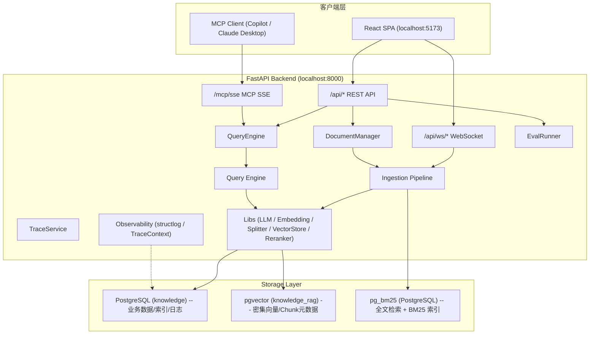

### 5.2 目录结构

```
knowledge-service/
│
├── backend/                                # FastAPI 后端
│   ├── app/                                # FastAPI 应用代码
│   │   ├── __init__.py
│   │   ├── main.py                         # FastAPI 应用入口
│   │   │
│   │   ├── api/                            # REST API & WebSocket
│   │   │   ├── __init__.py
│   │   │   ├── router.py                   # 主路由聚合
│   │   │   ├── dependencies.py             # 公共依赖注入
│   │   │   ├── config.py                   # /api/health, /api/config, /api/stats
│   │   │   ├── documents.py                # /api/collections, /api/documents/*
│   │   │   ├── ingestion.py                # /api/ingestion/*
│   │   │   ├── assistant.py                # /api/assistant/*（智能问答 + 对话管理）
│   │   │   ├── query.py                    # /api/query, /api/query/traces
│   │   │   ├── traces.py                   # /api/ingestion/traces/*
│   │   │   ├── evaluation.py               # /api/evaluation/*
│   │   │   └── images.py                   # /api/images/*
│   │   │
│   │   ├── mcp/                            # MCP SSE Transport
│   │   │   ├── __init__.py
│   │   │   └── sse_server.py               # SSE 会话管理 + 工具注册
│   │   │
│   │   ├── core/                           # Core 层
│   │   │   ├── __init__.py
│   │   │   ├── settings.py                 # 配置加载与校验
│   │   │   ├── types.py                    # 核心数据类型契约
│   │   │   ├── query_engine/               # 查询引擎
│   │   │   │   ├── __init__.py
│   │   │   │   ├── query_processor.py
│   │   │   │   ├── hybrid_search.py
│   │   │   │   ├── dense_retriever.py
│   │   │   │   ├── sparse_retriever.py
│   │   │   │   ├── fusion.py
│   │   │   │   └── reranker.py
│   │   │   ├── response/                   # 响应构建
│   │   │   │   ├── __init__.py
│   │   │   │   ├── response_builder.py
│   │   │   │   └── citation_generator.py
│   │   │   └── trace/                      # 追踪模块
│   │   │       ├── __init__.py
│   │   │       ├── trace_context.py
│   │   │       └── trace_collector.py
│   │   │
│   │   ├── ingestion/                      # Ingestion 层
│   │   │   ├── __init__.py
│   │   │   ├── pipeline.py                 # Pipeline 主流程
│   │   │   ├── document_manager.py         # 文档生命周期管理
│   │   │   ├── chunking/
│   │   │   │   ├── __init__.py
│   │   │   │   ├── document_chunker.py     # 按文件类型路由分块策略
│   │   │   │   └── chunk_strategy.py       # 分块策略定义（MD/HTML/默认）
│   │   │   ├── transform/
│   │   │   │   ├── __init__.py
│   │   │   │   ├── base_transform.py
│   │   │   │   ├── chunk_refiner.py
│   │   │   │   └── metadata_enricher.py
│   │   │   ├── embedding/
│   │   │   │   ├── __init__.py
│   │   │   │   ├── dense_encoder.py
│   │   │   │   ├── sparse_encoder.py
│   │   │   │   └── batch_processor.py
│   │   │   └── storage/
│   │   │       ├── __init__.py
│   │   │       ├── vector_upserter.py      # pgvector Upsert
│   │   │       ├── bm25_indexer.py
│   │   │       └── image_storage.py
│   │   │
│   │   ├── libs/                           # 可插拔抽象层
│   │   │   ├── __init__.py
│   │   │   ├── loader/
│   │   │   │   ├── __init__.py
│   │   │   │   ├── base_loader.py
│   │   │   │   ├── pdf_loader.py
│   │   │   │   └── file_integrity.py
│   │   │   ├── llm/
│   │   │   │   ├── __init__.py
│   │   │   │   ├── base_llm.py
│   │   │   │   ├── llm_factory.py
│   │   │   │   ├── azure_llm.py
│   │   │   │   ├── openai_llm.py
│   │   │   │   ├── ollama_llm.py
│   │   │   │   └── deepseek_llm.py
│   │   │   ├── embedding/
│   │   │   │   ├── __init__.py
│   │   │   │   ├── base_embedding.py
│   │   │   │   ├── embedding_factory.py
│   │   │   │   ├── openai_embedding.py
│   │   │   │   ├── azure_embedding.py
│   │   │   │   └── ollama_embedding.py
│   │   │   ├── splitter/
│   │   │   │   ├── __init__.py
│   │   │   │   ├── base_splitter.py
│   │   │   │   ├── splitter_factory.py
│   │   │   │   ├── markdown_header_splitter.py
│   │   │   │   ├── html_header_splitter.py
│   │   │   │   └── recursive_splitter.py
│   │   │   ├── vector_store/
│   │   │   │   ├── __init__.py
│   │   │   │   ├── base_vector_store.py
│   │   │   │   ├── vector_store_factory.py
│   │   │   │   └── pgvector_store.py
│   │   │   ├── reranker/
│   │   │   │   ├── __init__.py
│   │   │   │   ├── base_reranker.py
│   │   │   │   ├── reranker_factory.py
│   │   │   │   ├── cross_encoder_reranker.py
│   │   │   │   └── llm_reranker.py
│   │   │   └── evaluator/
│   │   │       ├── __init__.py
│   │   │       ├── base_evaluator.py
│   │   │       ├── evaluator_factory.py
│   │   │       ├── ragas_evaluator.py
│   │   │       └── custom_evaluator.py
│   │   │
│   │   └── observability/                  # 可观测性
│   │       ├── __init__.py
│   │       ├── logger.py                   # structlog 配置
│   │       └── evaluation/
│   │           ├── __init__.py
│   │           ├── eval_runner.py
│   │           └── composite_evaluator.py
│   │
│   ├── config/
│   │   ├── settings.yaml                   # 系统配置
│   │   └── logrotate.conf                  # 日志轮转配置
│   ├── logs/
│   │   └── service.jsonl
│   ├── scripts/
│   │   ├── __init__.py
│   │   ├── init_knowledge_db.sql
│   │   └── init_knowledge_rag_db.sql
│   ├── tests/
│   │   ├── __init__.py
│   │   ├── unit/
│   │   ├── integration/
│   │   ├── e2e/
│   │   └── fixtures/
│   │       ├── sample_documents/
│   │       │   ├── employee_handbook_zh.md
│   │       │   ├── compliance_guide_en.md
│   │       │   ├── technical_spec.html
│   │       │   └── architecture_overview.pdf
│   │       └── golden_test_set.json
│   ├── pyproject.toml
├── frontend/                               # React 前端
│   ├── index.html
│   ├── package.json
│   ├── vite.config.ts
│   ├── tsconfig.json
│   ├── tsconfig.app.json
│   ├── tsconfig.node.json
│   ├── eslint.config.js
│   ├── .gitignore
│   └── src/
│       ├── main.tsx
│       ├── App.tsx
│       ├── index.css
│       ├── api/
│       │   ├── client.ts
│       │   ├── config.ts
│       │   ├── documents.ts
│       │   ├── ingestion.ts
│       │   ├── assistant.ts
│       │   ├── query.ts
│       │   └── evaluation.ts
│       ├── types/
│       │   └── index.ts
│       ├── hooks/
│       │   └── useWebSocket.ts
│       ├── pages/
│       │   ├── Overview.tsx
│       │   ├── DocumentCenter.tsx
│       │   ├── AIAssistant.tsx
│       │   ├── DataBrowser.tsx
│       │   ├── IngestionManager.tsx
│       │   ├── IngestionTraces.tsx
│       │   ├── QueryTraces.tsx
│       │   └── EvaluationPanel.tsx
│       └── components/
│           ├── AppLayout.tsx
│           ├── HistoryChart.tsx
│           ├── MetricsCard.tsx
│           ├── ConfigCard.tsx
│           ├── ChatMessage.tsx
│           ├── CitationCard.tsx
│           ├── WaterfallChart.tsx
│           ├── DenseSparseCompare.tsx
│           ├── RerankComparison.tsx
│           ├── MetricsPanel.tsx
│           └── ProgressOverlay.tsx
│
├── DEV_SPEC.md
└── README.md
```
### 5.3 模块说明

#### 5.3.1 后端 API 层

| 模块 | 职责 | 关键技术点 |
|------|------|----------|
| `main.py` | FastAPI 应用入口 | lifespan 管理、CORS 配置、路由注册、MCP SSE 挂载 |
| `api/router.py` | REST 路由聚合 | APIRouter 分组，tags |
| `api/dependencies.py` | 公共依赖注入 | get_settings / get_document_manager / get_query_engine / get_db_pool |
| `api/config.py` | 系统概览 | 从 Settings 读取配置、DocumentManager 读取统计 |
| `api/documents.py` | 数据浏览 | 封装 pgvector / pg_bm25 / ImageStorage 读取 |
| `api/ingestion.py` | 摄取管理 | 文件上传（自动识别类型）、Pipeline 触发、进度查询、文档删除 |
| `api/query.py` | 查询 + 追踪 | HybridSearch 调用、Trace 文件读取 |
| `api/evaluation.py` | 评估 | EvalRunner 触发、指标读取、历史趋势 |
| `api/images.py` | 图片服务 | 从文件系统读取图片返回 |
| `mcp/sse_server.py` | MCP SSE | SSE 会话管理、MCP 工具注册（共享 core 实现） |

#### 5.3.2 Core 层

| 模块 | 职责 | 关键技术点 |
|------|------|----------|
| `settings.py` | 配置加载与校验 | 读取 `config/settings.yaml`，含数据库连接配置 |
| `types.py` | 核心数据类型契约 | Document/Chunk/ChunkRecord + category/language 字段 |
| `query_processor.py` | 查询预处理 | 关键词提取、同义词扩展、Metadata 过滤（category/language） |
| `hybrid_search.py` | 混合检索编排 | 并行 Dense/Sparse 召回，结果融合 |
| `dense_retriever.py` | pgvector 语义检索 | Query Embedding + pgvector `<=>` 检索 |
| `sparse_retriever.py` | BM25 检索 | 倒排索引查询 |
| `fusion.py` | 结果融合 | RRF 算法 |
| `reranker.py` | 精排重排 | CrossEncoder / LLM Rerank / Fallback |
| `response_builder.py` | 响应构建 | MCP 响应格式化 |
| `citation_generator.py` | 引用生成 | 结构化引用列表 |
| `trace_context.py` | 追踪上下文 | trace_id 生成、阶段记录、finish 汇总 |
| `trace_collector.py` | 追踪收集器 | 收集 trace 并触发 structlog 写出 |

#### 5.3.3 Ingestion 层

| 模块 | 职责 | 关键技术点 |
|------|------|----------|
| `pipeline.py` | Pipeline 编排 | 串行执行、异常处理、增量更新、on_progress 回调 |
| `document_manager.py` | 文档生命周期 | list/delete/stats，跨存储协调（pgvector + pg_bm25 + Image + PostgreSQL） |
| `document_chunker.py` | 分块策略路由 | 按文件类型选择 MD / HTML / 默认分块器 |
| `chunk_strategy.py` | 分块策略定义 | MarkdownHeaderTextSplitter / HTMLHeaderTextSplitter / RecursiveCharacterTextSplitter |
| `base_transform.py` | Transform 抽象 | 原子化、幂等、可独立重试 |
| `chunk_refiner.py` | Chunk 智能重组 | 规则去噪 + 可选 LLM |
| `metadata_enricher.py` | 元数据增强 | Title/Summary/Tags + category/language |
| `dense_encoder.py` | 稠密编码 | 通过 libs.embedding，批处理 |
| `sparse_encoder.py` | 稀疏编码 | BM25 |
| `vector_upserter.py` | pgvector Upsert | 幂等，vector 数据类型写入 |
| `bm25_indexer.py` | BM25 索引 | 倒排索引 + IDF |
| `image_storage.py` | 图片存储 | 本地文件 + PostgreSQL 索引 |

#### 5.3.4 Libs 层（可插拔抽象）

| 抽象接口 | 默认实现 | 可替换 |
|---------|---------|--------|
| `BaseLLM` | Azure OpenAI | OpenAI / Ollama / DeepSeek |
| `BaseEmbedding` | OpenAI | BGE / Ollama |
| `BaseSplitter` | 文件类型路由 | MarkdownHeader / HTMLHeader / Recursive |
| `BaseVectorStore` | pgvector | Qdrant / Pinecone |
| `BaseReranker` | CrossEncoder | LLM / None |
| `BaseEvaluator` | Ragas | DeepEval / Custom |
| `BaseLoader` | PDF (MarkItDown) | Markdown / HTML |

#### 5.3.5 前端层

| 模块 | 职责 | 关键点 |
|------|------|--------|
| `api/client.ts` | Axios 封装 | base URL、错误拦截 |
| `api/config.ts` | 系统配置 API | 读取 LLM/Embedding/Reranker 等组件配置 |
| `pages/Overview.tsx` | 系统总览 | ConfigCard x6、StatsTable |
| `pages/DocumentCenter.tsx` | 文档中心 | DocLibraryTable（筛选/批量/状态）、UploadArea、CollectionManager |
| `pages/AIAssistant.tsx` | AI 知识助手 | ChatPanel（对话消息）、ConvSidebar（对话列表）、SettingsBar（检索模式切换 + 重排序开关） |
| `pages/DataBrowser.tsx` | 数据浏览 | DocumentTable（支持 category/language 筛选）、ChunkDetailPanel |
| `pages/IngestionManager.tsx` | 摄取管理 | Dragger、ProgressOverlay、DocumentList |
| `pages/IngestionTraces.tsx` | 摄取追踪 | WaterfallChart、StageAccordion |
| `pages/QueryTraces.tsx` | Query 追踪 | MetricsPanel（p50/p95/令牌/缓存/拒绝/符合率）、DenseSparseCompare、RerankComparison |
| `pages/EvaluationPanel.tsx` | 评估面板 | MetricCard、HistoryChart |
| `components/AppLayout.tsx` | 主布局 | Ant Design Layout (Sider + Content + Menu)，8 导航项 |
| `components/HistoryChart.tsx` | 历史趋势图 | Recharts 封装，支持多指标叠加 |
| `components/MetricsCard.tsx` | 指标卡片 | 单值/趋势/目标对比展示 |
| `components/ConfigCard.tsx` | 系统配置卡片 | 展示 LLM/Embedding/Reranker 等组件配置状态 |
| `components/WaterfallChart.tsx` | 瀑布图组件 | 展示 Ingestion/Query 各阶段耗时 |
| `components/DenseSparseCompare.tsx` | 检索对比组件 | Dense/Sparse 检索结果对比展示 |
| `components/RerankComparison.tsx` | 重排序对比组件 | Rerank 前后排序变化展示 |
| `components/ChatMessage.tsx` | 聊天气泡 | 用户/AI 消息、Markdown 渲染、引用展开 |
| `components/CitationCard.tsx` | 引用卡片 | 来源文件、Chunk 片段、相关性分 |

### 5.4 数据流说明

#### 5.4.1 离线数据摄取流 (Ingestion Flow)

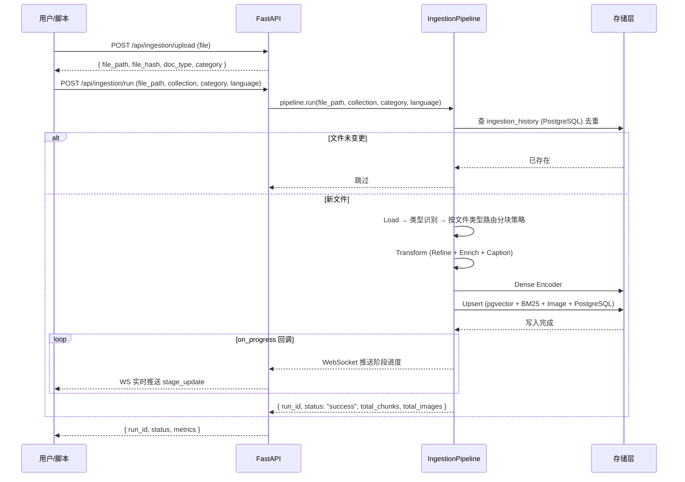

#### 5.4.2 在线查询流 (Query Flow)

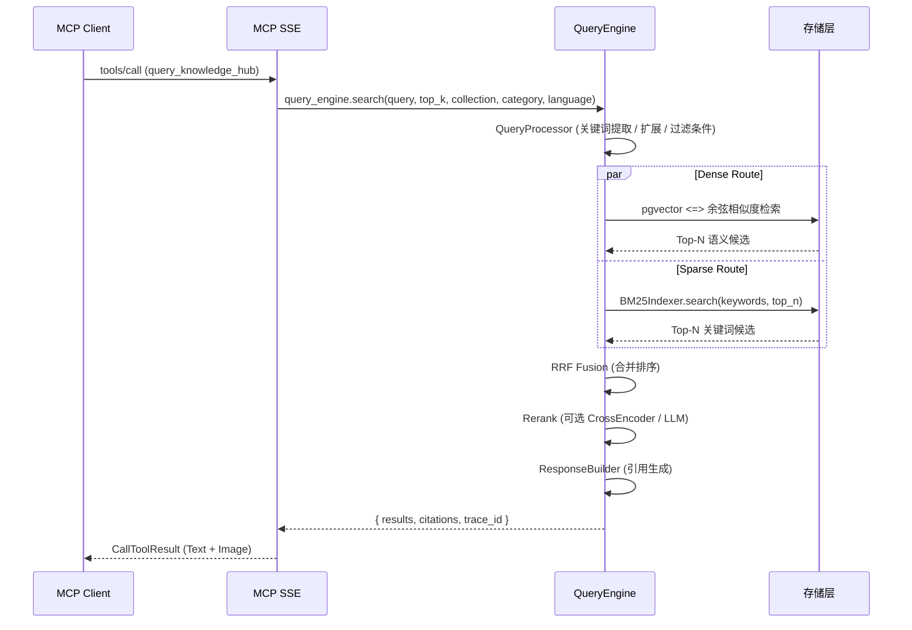

#### 5.4.3 管理操作流 (Management Flow)

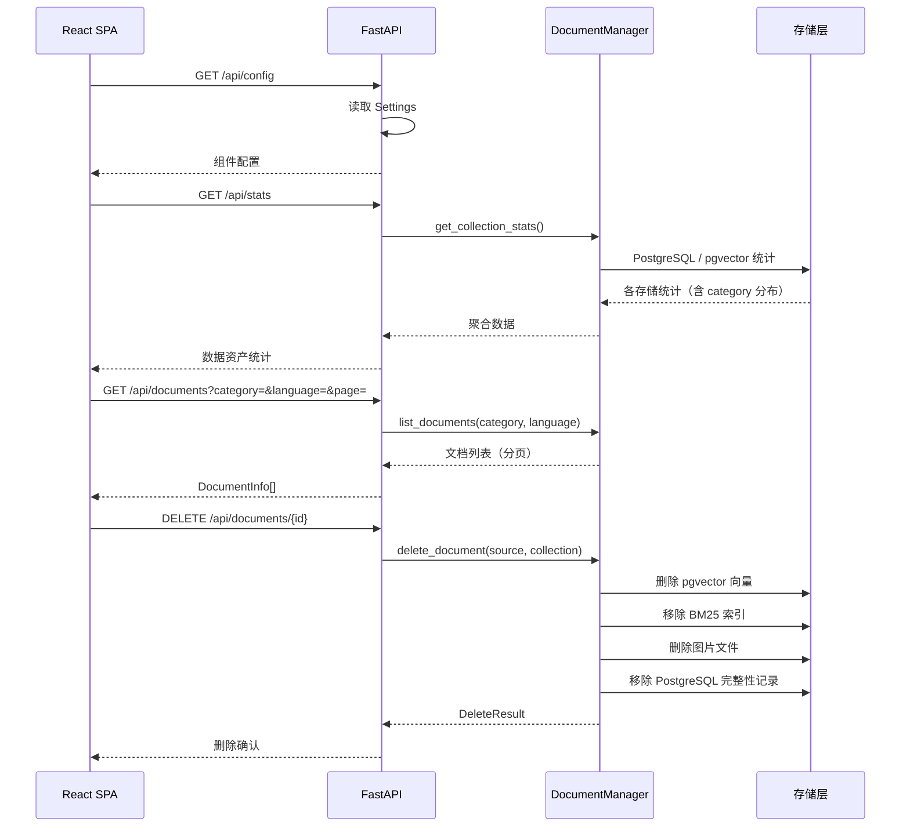

### 5.5 配置驱动设计

配置文件 `config/settings.yaml`：

```yaml
# ===== 数据库配置 =====
database:
  host: localhost
  port: 5432
  user: postgres
  password: root123456
  database: knowledge
  max_connections: 10

vector_store:
  backend: pgvector              # pgvector | qdrant | pinecone
  host: localhost
  port: 5432
  user: postgres
  password: root123456
  database: knowledge_rag
  table_name: document_chunks
  embedding_dimensions: 1536

# ===== 稀疏检索配置 =====
sparse_search:
  backend: pg_bm25              # pg_bm25 | elasticsearch
  host: localhost
  port: 5432
  user: postgres
  password: root123456
  database: knowledge_rag


# ===== LLM 配置 =====
llm:
  provider: azure                # azure | openai | ollama | deepseek
  model: gpt-4o

embedding:
  provider: openai
  model: text-embedding-3-small

# ===== 分块策略 =====
splitter:
  markdown:
    type: markdown_header
    headers_to_split_on: [("#", "h1"), ("##", "h2"), ("###", "h3")]
    chunk_size: 1000
    chunk_overlap: 200
  html:
    type: html_header
    headers_to_split_on: [("h1", "h1"), ("h2", "h2"), ("h3", "h3")]
    chunk_size: 1000
    chunk_overlap: 200
  default:
    type: recursive_character
    chunk_size: 1000
    chunk_overlap: 200
    separators: ["\n\n", "\n", ".", "!", "?", ",", " ", ""]

# ===== 检索配置 =====
retrieval:
  sparse_backend: pg_bm25        # pg_bm25 | elasticsearch
  fusion_algorithm: rrf          # rrf | weighted_sum
  rerank_backend: cross_encoder  # none | cross_encoder | llm

# ===== 评估配置 =====
evaluation:
  backends: [ragas, custom_metrics]

# ===== 可观测性 =====
observability:
  enabled: true
  logging:
    log_file: logs/service.jsonl
    log_level: INFO
    service_name: knowledge_service      # 服务标识

# ===== 服务配置 =====
server:
  port: 8000
  max_file_size: 52428800              # 文件上传大小上限（50MB，单位字节）
  allowed_extensions: ["pdf", "md", "html"]  # 允许上传的文件类型
```

**切换流程**：
1. 修改 `settings.yaml` 中对应组件的 `backend` / `provider` 字段
2. 确保新后端的依赖已安装、凭据已配置
3. 重启服务，工厂函数自动加载新实现

### 5.6 数据持久化层设计（Repository 模式 + 迁移路线图）

#### 5.6.1 Repository 接口设计

每个实体对应一个 Repository 类，所有 Repository 遵循统一模式：

| Repository | 对应表 | 核心方法 |
|-----------|-------|---------|
| `DocumentRepository` | `documents` | find_by_id / find_by_hash / save / delete / find_all / count |
| `ChunkRepository` | `document_chunks` | find_by_id / find_by_document / save_batch / delete_by_document |
| `IngestionHistoryRepository` | `ingestion_history` | find_by_id / find_by_hash / save / update_status / paginate |
| `TraceRepository` | `ingestion_traces` | find_by_id / save / paginate |
| `ConversationRepository` | `conversations` | find_by_id / find_by_session / save / delete / paginate |

#### 5.6.2 分层结构

```
app/
  repositories/           # Repository 层
    __init__.py
    base.py               # 抽象基类（可选的通用 CRUD）
    document_repo.py
    chunk_repo.py
    ingestion_history_repo.py
    trace_repo.py
    conversation_repo.py
  models/                 # ORM 模型（第二阶段引入）
    __init__.py
    document.py
    chunk.py
    ...
  schemas/                # Pydantic DTO（第二阶段引入）
    __init__.py
    document.py
    chunk.py
    ...
```

#### 5.6.3 迁移策略

| 步骤 | 内容 | 依赖 |
|------|------|------|
| **Phase 1** | 抽取 Repository 类封装原始 asyncpg SQL | 零新依赖 |
| **Phase 1.1** | API 层 + Pipeline 层改用 Repository 接口 | Phase 1 |
| **Phase 2** | 引入 SQLAlchemy 2.0 async，定义 ORM Model | sqlalchemy |
| **Phase 2.1** | 逐个 Repository 从 asyncpg 迁移到 SQLAlchemy 2.0 | Phase 2 |
| **Phase 3** | 引入 Alembic 管理数据库版本迁移 | alembic |
| **Phase 3.1** | 首次基线迁移（基于当前 schema 生成） | Phase 3 |
| **Phase 4** | 引入 Pydantic Schema，API 层改用 Schema 序列化 | pydantic v2 |

> **不引入分布式事务**：删除文档功能通过两个 Repository 调用同一个 `delete_document()` 方法确保一致性，跨表操作使用同一个连接上下文。

---

## 6. 项目排期

> **排期原则（严格对齐本 DEV_SPEC 的架构分层与目录结构）**
> 
> - **只按本文档设计落地**：以第 5.2 节目录树为"交付清单"，每一步都要在文件系统上产生可见变化。
> - **1 小时一个可验收增量**：每个小阶段（≈1h）都必须同时给出"验收标准 + 测试方法"，尽量做到 TDD。
> - **先打通主闭环，再补齐默认实现**：优先做"可跑通的端到端路径（Ingestion → Retrieval → MCP Tool）"，并在 Libs 层补齐可运行的默认后端实现，避免出现"只有接口没有实现"的空转。
> - **外部依赖可替换/可 Mock**：LLM/Embedding/Vision/VectorStore 的真实调用在单元测试中一律用 Fake/Mock，集成测试再开真实后端（可选）。

### 阶段总览（大阶段 → 目的）

1. **阶段 A：工程骨架与测试基座**
   - 目的：建立可运行、可配置、可测试的工程骨架；后续所有模块都能以 TDD 方式落地。
2. **阶段 B：Libs 可插拔层（Factory + Base 接口 + 默认可运行实现）**
   - 目的：把"可替换"变成代码事实；并补齐可运行的默认后端实现，确保 Core / Ingestion 不仅"可编译"，还可在真实环境跑通。
3. **阶段 C：Ingestion Pipeline（PDF→MD→Chunk→Embedding→Upsert）**
   - 目的：离线摄取链路跑通，能把样例文档写入 pgvector / BM25 索引并支持增量。
4. **阶段 D：Retrieval（Dense + Sparse + RRF + 可选 Rerank）**
   - 目的：在线查询链路跑通，得到 Top-K chunks（含引用信息），并具备稳定回退策略。
5. **阶段 E：后端服务层（FastAPI + REST API + MCP SSE）**
   - 目的：搭建 FastAPI 后端，实现 REST API 供前端调用，同时通过 SSE Transport 暴露 MCP 工具，让 Copilot/Claude 可直接查询知识库。
6. **阶段 F：Trace 基础设施与打点**
   - 目的：实现 structlog 结构化日志（JSON 格式 + 固定字段 + logrotate），在 Ingestion + Query 双链路打点，添加 Pipeline 进度回调。
7. **阶段 G：前端 Dashboard（React 可视化管理平台）**
   - 目的：搭建 React 8 页面管理平台（系统总览 / 数据浏览 / 文档中心 / AI 知识助手 / Ingestion 管理 / Ingestion 追踪 / Query 追踪 / 评估面板），实现完整的可视化管理体验。
8. **阶段 H：评估体系**
   - 目的：实现 RagasEvaluator + CompositeEvaluator + EvalRunner，启用评估面板页面，建立 golden test set 回归基线。
9. **阶段 I：端到端验收与文档收口**
   - 目的：补齐 E2E 测试（API 调用模拟 + MCP SSE 连接 + 前端冒烟），完善 README，全链路验收。
10. **阶段 J：数据持久化层重构（Repository + SQLAlchemy 2.0 + Alembic）**
   - 目的：分阶段重构持久化层，先从 Repository 模式抽取原始 SQL，再引入 SQLAlchemy 2.0 async + Alembic 迁移 + Pydantic Schema，实现类型安全、可迁移、可测试的数据持久化层。

---

### 📊 进度跟踪表 (Progress Tracking)

> **状态说明**：`[ ]` 未开始 | `[~]` 进行中 | `✅` 已完成
> 
> **更新时间**：每完成一个子任务后更新对应状态

#### 阶段 A：工程骨架与测试基座

| 任务编号 | 任务名称 | 状态 | 完成日期 | 备注 |
|---------|---------|------|---------|------|
| A1 | 初始化目录树与最小可运行入口 | ✅ | 2026-06-14 | 启动方式：后端 `cd backend && uv run uvicorn app.main:app --reload --port 8000`；前端 `cd frontend && pnpm dev` |
| A2 | 引入 pytest 并建立测试目录约定 | ✅ | 2026-06-14 | conftest.py (client + sample_settings fixture), test_health.py (2 tests), pytest markers (unit/integration/e2e/llm) | |
| A3 | 配置加载与校验（Settings + 数据库连接配置） | ✅ | 2026-06-14 | settings.py (pydantic validators/env_nested_delimiter), test_settings.py (30 tests) | |
| A4 | PostgreSQL + pgvector + tsvector/GIN 数据库初始化 | ✅ | 2026-06-14 | init_knowledge_db.sql + init_knowledge_rag_db.sql；BM25 评分在应用层实现（T11 pg_bm25 迁移待后续） |
| A5 | 前端项目初始化（Vite + React 19 + TypeScript + Ant Design 5 + React Router） | ✅ | 2026-06-14 | 前端骨架，设计规范遵循 UI-UX-Pro-Max skill 指导原则 |
| A6 | API Client 层构建（Axios + TypeScript 类型定义 + 错误拦截器） | ✅ | 2026-06-14 |
| A7 | 前端 Layout + Router 框架（Ant Design Layout + 8 路由配置） | ✅ | 2026-06-14 |
| A8 | 全局状态管理 + 主题配置 | ✅ | 2026-06-14 | 主题 via ConfigProvider，全局状态使用 React useState/useEffect 各页独立管理 |
| A9 | 通用组件库搭建（recharts 图表等第三方依赖引入） | ✅ | 2026-06-14 | HistoryChart, MetricsCard, useWebSocket hook |
| A10 | 前端项目构建配置验证（Vite + ESLint + Prettier 配置） | ✅ | 2026-06-14 | eslint.config.js, tsconfig.app.json, tsconfig.node.json |

#### 阶段 B：Libs 可插拔层

| 任务编号 | 任务名称 | 状态 | 完成日期 | 备注 |
|---------|---------|------|---------|------|
| B1 | LLM 抽象接口与工厂 | ✅ | 2026-06-14 | 
| B2 | Embedding 抽象接口与工厂 | ✅ | | |
| B3 | Splitter 抽象接口与工厂 | ✅ | | |
| B4 | VectorStore 抽象接口与工厂（pgvector 契约） | ✅ | | |
| B5 | Reranker 抽象接口与工厂（含 None 回退） | ✅ | | |
| B6 | Evaluator 抽象接口与工厂 | ✅ | | |
| B7.1 | OpenAI-Compatible LLM（OpenAI/Azure） | ✅ | 2026-06-14 | 
| B7.11 | DeepSeek LLM（专用实现，支持 usage 扩展 + reasoning_content） | ✅ | 2026-06-14 | 
| B7.2 | Ollama LLM（本地后端） | ✅ | 2026-06-14 | 
| B7.3 | OpenAI & Azure Embedding 实现 | ✅ | | |
| B7.4 | Ollama Embedding 实现 | ✅ | | |
| B7.5 | MarkdownHeaderTextSplitter 实现 | ✅ | | |
| B7.6 | HTMLHeaderTextSplitter 实现 | ✅ | | |
| B7.7 | RecursiveCharacterTextSplitter 实现 | ✅ | | |
| B7.8 | pgvector store（VectorStore 默认后端） | ✅ | | 含 PostgreSQL 连接池 |
| B7.9 | LLM Reranker 实现 | ✅ | 2026-06-14 | CrossEncoderReranker 通过 LLM API 评分排序 |
| B7.10 | Cross-Encoder Reranker 实现 | ✅ | | |
| B8 | Vision LLM 抽象接口与工厂集成 | [-] | | 暂不实现（无 Vision LLM） |
| B9 | Azure Vision LLM 实现 | [-] | | 暂不实现 |

#### 阶段 C：Ingestion Pipeline MVP

| 任务编号 | 任务名称 | 状态 | 完成日期 | 备注 |
|---------|---------|------|---------|------|
| C1 | 定义核心数据类型/契约（Document/Chunk/ChunkRecord + category/language） | ✅ | 2026-06-14 | models.py 已创建，含 IngestionDocument/ChunkRecord/IngestionResult/IngestionProgress |
| C2 | 文件完整性检查（SHA256 + PostgreSQL） | ✅ | 2026-06-14 | FileIntegrityChecker 类 + IntegrityCheckResult 结果类型 |
| C3 | Loader 抽象基类与 PDF/HTML/MD Loader | ✅ | 2026-06-14 | 含 PDF/HTML/Markdown 三种 Loader 实现 |
| C4 | Splitter 集成（按文件类型路由分块策略） | ✅ | 2026-06-14 | MarkdownHeader/HTMLHeader/RecursiveCharacter + 工厂路由 |
| C5 | Transform 基类 + ChunkRefiner | ✅ | 2026-06-14 | Chunk 文本清洗与规范化 |
| C6 | MetadataEnricher | ✅ | 2026-06-14 | 文档级元数据注入 |
| C7 | ImageCaptioner | [-] | | 暂不实现 |
| C8 | DenseEncoder | ✅ | 2026-06-14 | |
| C9 | SparseEncoder | [ ] | | |
| C10 | BatchProcessor | ✅ | 2026-06-14 | |
| C11 | BM25Indexer（PostgreSQL 全文检索） | ✅ | 2026-06-14 | |
| C12 | VectorUpserter（pgvector 幂等 upsert） | ✅ | 2026-06-14 | |
| C13 | ImageStorage（图片存储+PostgreSQL 索引） | [ ] | | |
| C14 | Pipeline 编排（MVP 串起来） | ✅ | 2026-06-14 | |
| C15 | 脚本入口 ingest.py | ✅ | 2026-06-14 | |

#### 阶段 D：Retrieval MVP

| 任务编号 | 任务名称 | 状态 | 完成日期 | 备注 |
|---------|---------|------|---------|------|
| D1 | QueryProcessor（参数验证 + search_mode/top_k/filters） | ✅ | 2026-06-14 | query_processor.py |
| D2 | DenseRetriever（EmbeddingFactory + PGVectorStore） | ✅ | 2026-06-14 | dense_retriever.py |
| D3 | SparseRetriever（BM25Indexer 封装） | ✅ | 2026-06-14 | sparse_retriever.py |
| D4 | RRF Fusion（倒数排序融合） | ✅ | 2026-06-14 | rrf_fusion.py |
| D5 | HybridSearch 编排（Dense→Sparse→RRF→Rerank） | ✅ | 2026-06-14 | hybrid_search.py |
| D6 | Reranker（Core 层编排 + Fallback） | ✅ | 2026-06-14 | reranker.py |
| D7 | 脚本入口 query.py（CLI 查询可用） | ✅ | 2026-06-14 | query.py |

#### 阶段 E：后端服务层（FastAPI + REST API + MCP SSE）

| 任务编号 | 任务名称 | 状态 | 完成日期 | 备注 |
|---------|---------|------|---------|------|
| E1 | FastAPI 应用入口 + CORS + lifespan | ✅ | 2026-06-14 | DB 池 + API 路由 + MCP SSE 已挂载 |
| E2 | API 路由聚合 + 公共依赖注入（含数据库连接池） | ✅ | 2026-06-14 | router.py + database.py (get_kb_conn/get_rag_conn) |
| E3 | REST API：系统配置与统计端点 | ✅ | 2026-06-14 | system.py（config + stats） |
| E4 | REST API：数据浏览端点 | ✅ | 2026-06-14 | data.py（documents/chunks/collections/categories/languages） |
| E5 | REST API：Ingestion 管理端点（含文件类型校验 / 大小限制 / 速率限制） | ✅ | 2026-06-14 | ingestion.py（upload + 校验 + 限流） |
| E6 | REST API：查询与追踪端点 | ✅ | 2026-06-14 | query.py（search + traces + metrics） |
| E7 | REST API：评估端点 | ✅ | 2026-06-14 | evaluation.py（testsets + run + results） |
| E8 | REST API：图片服务端点 | ✅ | 2026-06-14 | images.py（get_image + metadata） |
| E9 | WebSocket 实时进度推送 | ✅ | 2026-06-14 | main.py 已注册 /api/ws/ingestion/progress |
| E10 | MCP SSE Transport 集成 | ✅ | 2026-06-14 | server.py（FastMCP + sse_app） |
| E11 | MCP 工具注册（query_knowledge_hub / list_collections / get_document_summary） | ✅ | 2026-06-14 | 3 个工具已注册 |
| E12 | 文档管理 API（文档 metadata 更新 / 批量删除 / 重新索引 / 集合管理 / 文档统计） | ✅ | 2026-06-14 | documents.py（CRUD + batch + reindex + stats） |
| E13 | AI 知识助手 API（问答查询 + 对话历史 CRUD + 对话管理） | ✅ | 2026-06-14 | assistant.py（ask + sessions CRUD） |
| E14 | 查询缓存层（query result cache + embedding cache，含 TTL 过期 + 自动清理） | ✅ | 2026-06-14 | cache.py（QueryCache + EmbeddingCache + 后台清理协程） |
| E15 | 数据库连接池调优 + pgvector HNSW 索引 + LLM 调用超时控制 | ✅ | 2026-06-14 | timeout + pool_min/max_size + HNSW 已在 init SQL |

#### 阶段 F：Trace 基础设施与打点

| 任务编号 | 任务名称 | 状态 | 完成日期 | 备注 |
|---------|---------|------|---------|------|
| F1 | structlog 配置（JSON 格式 + 固定字段 + service name） | ✅ | 2026-06-14 | |
| F2 | logrotate 配置 | ✅ | 2026-06-14 | |
| F3 | TraceContext 实现（trace_id / span_id / parent_span_id） | ✅ | 2026-06-14 | |
| F4 | request_id 中间件（FastAPI 中注入） | ✅ | 2026-06-14 | |
| F5 | 在 Ingestion + Query 双链路打点 | ✅ | 2026-06-14 | 框架已就绪，实际调用在 C/D 阶段接入 |
| F6 | Pipeline 进度回调 (on_progress) | ✅ | 2026-06-14 | |

#### 阶段 G：前端 Dashboard（React 可视化管理平台）

| 任务编号 | 任务名称 | 状态 | 完成日期 | 备注 |
|---------|---------|------|---------|------|
| G1 | Overview + Data Browser 页面（含 category/language 筛选） | ✅ | 2026-06-14 | |
| G2 | Ingestion Manager + Ingestion Traces 页面 | ✅ | 2026-06-14 | |
| G3 | Query Traces + Evaluation Panel 页面 | ✅ | 2026-06-14 | |
| G4 | 图表组件（WaterfallChart / HistoryChart）+ WebSocket 集成 | ✅ | 2026-06-14 | |
| G5 | 文档中心页面（文档库管理 + 文件上传 + 批量操作 + 集合管理） | ✅ | 2026-06-14 | |
| G6 | AI 知识助手页面（对话式问答 + 检索模式切换 + 重排序开关 + 引用溯源 + 对话历史管理） | ✅ | 2026-06-14 | |

#### 阶段 H：评估体系

| 任务编号 | 任务名称 | 状态 | 完成日期 | 备注 |
|---------|---------|------|---------|------|
| H1 | RagasEvaluator 实现 | ✅ | 2026-06-16 | ragas 库集成，faithfulness/answer_relevancy/context_precision/context_recall | |
| H2 | CompositeEvaluator + EvaluatorFactory 实现 | ✅ | 2026-06-16 | 工厂策略模式，组合 Basic + Ragas，预留 deepeval 接入点 | |
| H3 | EvalRunner + Golden Test Set | ✅ | 2026-06-16 | 支持单查询 + 测试集全量运行 | |
| H4 | 评估面板页面完善 | ✅ | 2026-06-16 | API + Schema + 前端已对接 | |
| H5 | Recall 回归测试（E2E，按 category 分层评估） | ✅ | 2026-06-16 | 20 个单元测试通过 | |

#### 阶段 I：端到端验收与文档收口

| 任务编号 | 任务名称 | 状态 | 完成日期 | 备注 |
|---------|---------|------|---------|------|
| I1 | E2E：REST API 调用模拟 | [ ] | | |
| I2 | E2E：MCP SSE 连接测试 | [ ] | | |
| I3 | E2E：前端冒烟测试（Playwright） | [ ] | | |
| I4 | 完善 README（运行说明 + 数据库初始化 + API + MCP + Dashboard） | [ ] | | |
| I5 | 全链路 E2E 验收 | [ ] | | |
#### 阶段 J：数据持久化层重构（Repository + SQLAlchemy 2.0 + Alembic）

| 任务编号 | 任务名称 | 状态 | 完成日期 | 备注 |
|---------|---------|------|---------|------|
| J1 | 定义 Repository 抽象基类与通用 CRUD 接口 | ✅ | 2026-06-14 | base.py（零额外依赖，封装 asyncpg 通用操作） |
| J2 | 实现 DocumentRepository | ✅ | 2026-06-14 | 替代散落在 API/Pipeline 中的 documents 表原始 SQL |
| J3 | 实现 IngestionHistoryRepository | ✅ | 2026-06-14 | |
| J4 | 实现 TraceRepository | ✅ | 2026-06-14 | |
| J5 | 实现 ConversationRepository | ✅ | 2026-06-14 | |
| J6 | API 层 + Pipeline 层切换为 Repository 调用 | ✅ | 2026-06-14 | 逐个替换，确保行为不变 |
| J7 | 引入 SQLAlchemy 2.0 async + 定义 ORM 模型 | ✅ | 2026-06-14 | 按当前 schema 精确映射 |
| J8 | 逐个 Repository 迁移到 SQLAlchemy 2.0 | ✅ | 2026-06-14 | 从 asyncpg 底层切换到 SQLAlchemy Core/ORM |
| J9 | 引入 Alembic，生成首次基线迁移 | [ ] | | 替换 `init_knowledge_db.sql` |
| J10 | 引入 Pydantic Schema，API 层改用 Schema | ✅ | 2026-06-16 | data/assistant/ingestion/documents 端点已加 response_model |

---

---

### 📈 总体进度

| 阶段 | 总任务数 | 已完成 | 进度 |
|------|---------|--------|------|
| 阶段 A | 10 | 10 | 100% |
| 阶段 B | 16 | 14 | 88% |
| 阶段 C | 14 | 12 | 86% |
| 阶段 D | 7 | 7 | 100% |
| 阶段 E | 15 | 15 | 100% |
| 阶段 F | 6 | 6 | 100% |
| 阶段 G | 6 | 6 | 100% |
| 阶段 H | 5 | 5 | 100% |
| 阶段 I | 5 | 0 | 0% |
| 阶段 J | 10 | 9 | 90% |
| **总计** | **94** | **84** | **89%** |
| **有效数** | **91** | **84** | **92%** | 3 项延期不计入有效任务 |
| **延期** | **3** | **—** | **—** | B8 / B9 / C7（Vision 多模态等，待条件成熟后实现） |


---

### 📋 TODO 清单（待后续条件成熟后实现）

> **状态说明**：`[ ]` 待规划 | `[~]` 进行中 | `[x]` 已完成

#### 多模态图片处理（依赖：具备 Vision LLM API）

| # | 任务名称 | 依赖 | 备注 |
|---|---------|------|------|
| T1 | Vision LLM 抽象接口与工厂集成 | 有 Vision LLM API 访问权限 | 对接 GPT-4o / Qwen-VL 等 |
| T2 | Azure Vision LLM 实现 | T1 | GPT-4o Vision 具体实现 |
| T3 | ImageCaptioner（图片描述生成） | T1 | Vision LLM 将图片转为文本 |
| T4 | MultimodalAssembler（多模态返回） | T3 | 检索结果同时返回文本 + 图片 |
| T5 | ImagePreview 前端组件 | T4 | 图片 Base64 渲染展示 |

#### 待定功能（未来可能的扩展方向）

| # | 任务名称 | 优先级 | 备注 |
|---|---------|--------|------|
| T6 | Agentic RAG（多步推理检索） | 中 | 支持复杂问句的分解检索 |
| T7 | Graph RAG（知识图谱增强） | 低 | 实体关系抽取 + 图检索 |
| T8 | 多 Collection 交叉检索 | 中 | 一次查询跨多个知识库 |
| T9 | 实时文档更新监听 | 低 | 文件系统 Watch + 自动重摄取 |
| T10 | RBAC 权限控制 | 低 | 多用户 + 文档级权限 |
| T11 | pg_bm25 索引重建窗口 | 中 | 大量写入后定期重建 BM25 索引，保持检索性能；可选 APScheduler 定时任务 |
| T12 | 配置分离（多环境） | 低 | settings.yaml + settings.local.yaml 分层配置，本地敏感信息不提交到仓库 |
| T13 | LLM/Embedding 调用 Circuit Breaker | 中 | LLM/Embedding 外部 API 调用添加熔断机制（一期暂不实现） |
